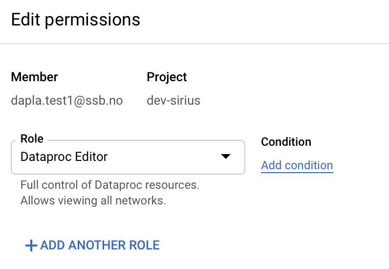

## Dataproc with Jupyterlab

This page describes two ways to create a Dataproc cluster with Jupyterlab

#### Shared dataproc cluster with Jupyterlab

This cluster can be accessed by any authenticated `team-brunost` member. The member must have the role `dataproc.editor` to be able to access Jupyterlab and run notebooks.

Setup:

```bash
sh dataproc/dataproc-shared-cluster.sh 
```




#### Personal dataproc cluster with Jupyterlab

When you create a Dataproc cluster, you can enable Dataproc Personal Cluster Authentication to allow interactive 
workloads on the cluster to securely run as your user identity. This means that interactions with other Google Cloud 
resources such as Cloud Storage will be authenticated as yourself instead of the cluster service account.

This setup consists of 3 steps:

##### 1. Create the dataproc cluster

```bash
sh dataproc/dataproc-personal-cluster.sh 
```

##### 2. Enable credential propagation

Enable a credential propagation session for the cluster to start using your personal credentials when interacting with 
Google Cloud resources.

*This must be run from a Cloud shell. Local terminal will not work unless we change the firewall settings:*

```bash
REGION=europe-north1
CLUSTER_NAME=spark-jupyter-brunost-cluster 

gcloud dataproc clusters enable-personal-auth-session \
    --region=${REGION} ${CLUSTER_NAME}
```
Keep the command running and switch to a new Cloud Shell tab or terminal session. The client will refresh the 
credentials while the command is running.

Type Ctrl-C to end the session.

##### 3. Enable Jupyterlab to authenticate with Kerberos

Log in to Jupyterlab and open a terminal window. This script will enable Jupyterlab to authenticate with Kerberos and 
submit Spark jobs.

```bash
kinit -kt /etc/security/keytab/dataproc.service.keytab dataproc/$(hostname -f)
```

Current findings:

- Shared dataproc cluster uses a common service account when interacting with Google Cloud resources
- A personal dataproc cluster can be set up using Personal Cluster Authentication. The propagated credentials are downscoped with a Credential Access Boundary. 
- The default access boundary is limited to reading and writing Cloud Storage objects in Cloud Storage buckets owned by the same project that contains the cluster.
- Only Cloud Storage supports Credential Access Boundaries. *Other Google Cloud services do not support this feature.*
- Dataproc Personal Cluster Authentication currently does not support Dataproc workflows.